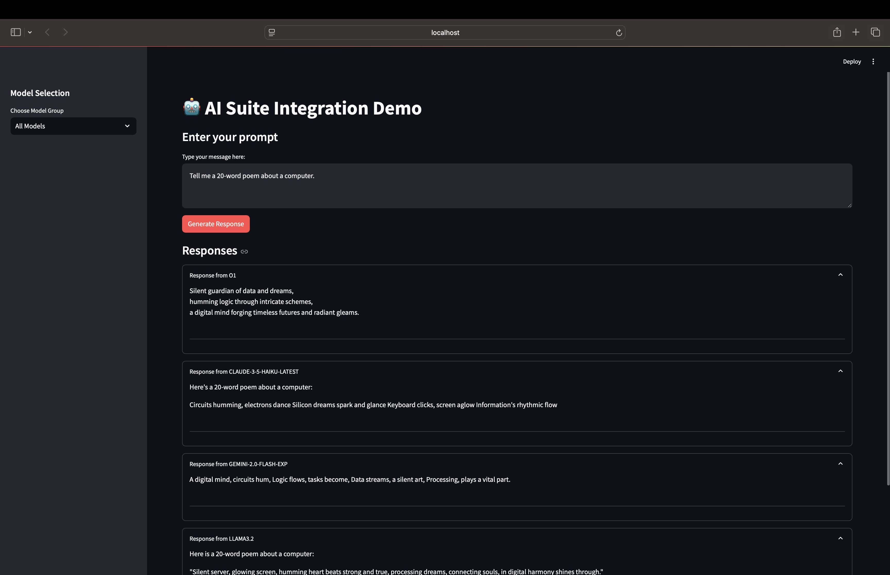
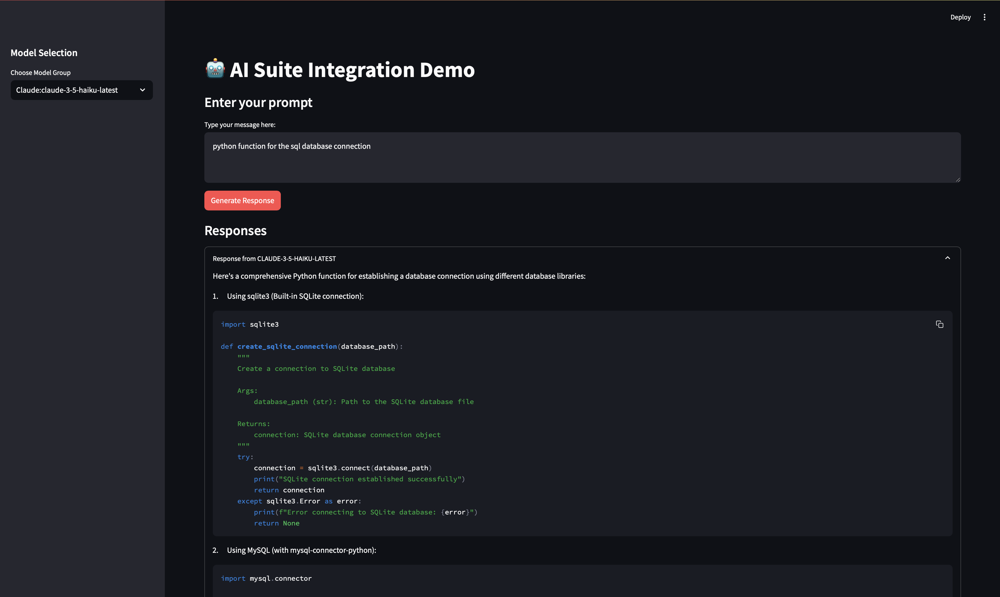

# AI Suite Integration Project

A Python-based project that demonstrates integration with multiple AI models through a unified interface using the AI Suite library.

## 🔍 Official Github Page ai-suites[Andrewy NG]
https://github.com/andrewyng/aisuite

## 📋 Table of Contents
- [Overview](#overview)
- [Official Github Page](#official-github-page)
- [Project Structure](#project-structure)
- [Prerequisites](#prerequisites)
- [Ollama Setup](#ollama-setup)
  - [Installation](#ollama-installation)
  - [Model Setup](#model-setup)
- [Installation](#installation)
- [Configuration](#configuration)
- [Usage](#usage)
  - [Command Line Usage](#command-line-usage)
  - [Streamlit App Usage](#streamlit-app-usage)
    - [Prerequisites](#prerequisites-1)
    - [Running the App](#running-the-app)
    - [App Features & Options](#app-features--options)
    - [Using the Interface](#using-the-interface)
    - [Performance Tips](#performance-tips)
- [Features](#features)
- [API Models Supported](#api-models-supported)
  - [OpenAI Models](#openai-models)
  - [Anthropic Models](#anthropic-models)
  - [Google Models](#google-models)
  - [Ollama Models](#ollama-models)
- [Security](#security)
- [License](#license)
- [Acknowledgments](#acknowledgments)

## 🔍 Overview

This project provides a unified interface to interact with various AI models including OpenAI, Anthropic's Claude, Google's Gemini, and Ollama models. It demonstrates how to fetch responses from multiple AI models using a consistent API approach.

## 📁 Project Structure

```
ai_suite/
├── src/
│   ├── config.py          # Configuration settings
│   └── main.py           # Main application logic
├── .gitignore           # Git ignore rules
├── .env                 # API credentials
├── requirements.txt      # Project dependencies
└── README.md            # Project documentation
```

## 🛠️ Prerequisites

- Python 3.12.8 or higher
- AI Suite library (`pip install aisuite[all]`)
- Valid API keys for:
  - OpenAI API
  - Anthropic Claude API
  - Google Gemini API
  - Ollama (local installation)

## 📥 Ollama Setup

1. Install Ollama:
   
   **For macOS:**
   ```bash
   curl https://ollama.ai/install.sh | sh
   ```

   **For Linux:**
   ```bash
   curl https://ollama.ai/install.sh | sh
   ```

   **For Windows:**
   - Download the installer from [Ollama Releases](https://github.com/ollama/ollama/releases)
   - Or use Windows Subsystem for Linux (WSL)

2. Start Ollama Service:
   ```bash
   ollama serve
   ```

3. Pull and Run Models:
   ```bash
   # Pull Llama models
   ollama pull llama2
   ollama pull llama2:3.2
   ollama pull llama2:3.3

   # Pull Mistral
   ollama pull mistral

   # Test a model
   ollama run llama2 "Tell me a joke"
   ```

4. Verify Installation:
   ```bash
   ollama --version
   ```

## 📥 Installation

1. Clone the repository:
   ```bash
   git clone https://github.com/AnupCloud/ai_suites.git
   cd ai_suites
   ```

2. Create a virtual environment:
   ```bash
   python -m venv venv
   source venv/bin/activate  # On Windows: venv\Scripts\activate
   ```

3. Install dependencies:
   ```bash
   pip install -r requirements.txt
   ```

## ⚙️ Configuration

1. Configure your environment variables in `.env`:
   ```env
   ANTHROPIC_API_KEY = "your-anthropic-key"
   OPENAI_API_KEY = "your-openai-key"
   GOOGLE_PROJECT_ID = "your-project-id"
   GOOGLE_REGION = "your-region"
   GOOGLE_APPLICATION_CREDENTIALS = "path/to/credentials.json"
   ```

## 🚀 Usage

### Command Line Usage
Run the example:
```bash
python src/main.py
```

Example Output:
```
Model: openai:o1
Output:
As the old year fades away,
Like snowflakes in the night,
A fresh beginning makes its way,
Bringing hope so bright.

Time turns another page anew,
Dreams and wishes take their flight,
The future beckons, clean and true,
In the New Year's gentle light.
----------------------------------------
Model: anthropic:claude-3-5-haiku-latest
Output:
Here's a poem for the New Year:

When midnight strikes and fireworks soar,
We bid farewell to days of yore.
Fresh hopes and dreams begin to spring,
As New Year bells start to ring.

Each moment holds a promise new,
Of chances fresh and skies of blue.
The past year's lessons light our way,
As we embrace this brand new day.
----------------------------------------
Model: google:gemini-2.0-flash-exp
Output:
Here's a New Year poem for you:

Time's wheel turns once more,
As we stand at tomorrow's door.
Memories of the year past fade,
While new dreams are carefully made.

Midnight chimes with promise sweet,
As old and new gently meet.
Hope rises like the morning sun,
A fresh chapter has begun.
----------------------------------------
Model: ollama:llama3.2
Output:
Here's a poem to welcome the New Year:

When December's last breath fades away,
And January dawns crisp and new,
We gather hopes like morning dew,
For all the dreams that come our way.

Each second brings a fresh start true,
In this grand cycle of time so dear,
Let's embrace the coming year,
With hearts both brave and spirits new.
----------------------------------------
```

### Streamlit App Usage
## 📸 Streamlit App Demo
All models

Single Model

#### Prerequisites
- All API keys configured in `.env`
- Ollama running locally (for Ollama models)
- Python 3.12.8 or higher
- Required packages installed

#### Running the App

1. **Start Ollama Service** (required for Ollama models):
   ```bash
   ollama serve
   ```

2. **Launch Streamlit App** (use either command):
   ```bash
   # Full path command
   streamlit run /Users/coschool/Desktop/Anup/project/ai_suites/src/app.py
   ```

   The app will be available at:
   - Local URL: http://localhost:8501
   - Network URL: http://192.168.1.42:8501

#### App Features & Options

1. **Model Selection (Sidebar)**
   ```python
   AVAILABLE_MODELS = {
       "All Models": [
           "openai:o1",
           "anthropic:claude-3-5-haiku-latest",
           "google:gemini-2.0-flash-exp",
           "ollama:llama3.2"
       ],
       "OpenAI:O1": ["openai:o1"],
       "Claude:claude-3-5-haiku-latest": ["anthropic:claude-3-5-haiku-latest"],
       "Gemini:gemini-2.0-flash-exp": ["google:gemini-2.0-flash-exp"],
       "Ollama:llama3.2": ["ollama:llama3.2"]
   }
   ```

2. **Main Interface Components**
   - Text input area for prompts
   - "Generate Response" button
   - Real-time processing indicator
   - Expandable response sections

#### Using the Interface

1. **Select Model(s)**
   - Choose "All Models" to compare responses
   - Or select specific model for faster processing

2. **Enter Prompt**
   - Type your query in the text area
   - Example: "Tell me a creative story about space exploration"

3. **View Responses**
   ```
   [Model: O1]
   [OpenAI's response appears here]
   ------------------------
   [Model: CLAUDE]
   [Claude's response appears here]
   ------------------------
   [Model: LLAMA3.2]
   [Ollama's response appears here]
   ```

#### Performance Tips
- Single model selection provides faster responses
- Local Ollama models have minimal latency
- Response times vary with prompt complexity
- Consider API rate limits for cloud services

## ✨ Features

- Unified interface for multiple AI models
- Consistent API approach across different providers
- Easy configuration through environment variables
- Support for both cloud-based and local AI models
- Extensible architecture for adding new models

## 🤖 API Models Supported

1. **OpenAI Models**
   - GPT-4
   - GPT-3.5-turbo
   - GPT-4o
   - GPT-O1

2. **Anthropic Models**
   - Claude 3 Opus
   - Claude 3.5 Sonnet
   - Claude 3.5 Haiku

3. **Google Models**
   - Gemini Pro
   - Gemini Pro Vision
   - Gemini Flash 2.0

4. **Ollama Models**
   - Llama 2, 3.2, 3.3
   - Mistral
   - Custom models

## 🔒 Security

- Never commit your `.env` file containing API keys
- Use environment variables for sensitive information
- Follow security best practices when handling API keys

## 📝 License

This project is licensed under the MIT License - see the [LICENSE](LICENSE) file for details.

## 🙏 Acknowledgments

- AI Suite library developers
- OpenAI team
- Anthropic team
- Google AI team
- Ollama community


